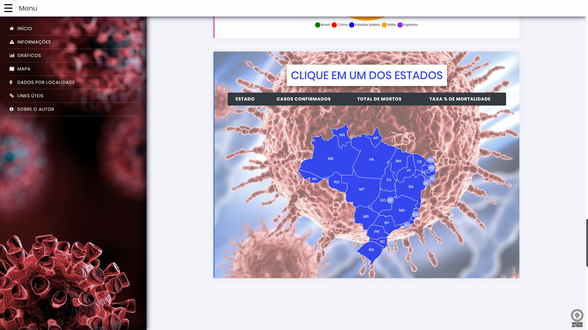

<h1 align="center">
   Corona News
</h1>


</h1>
<p align="center">Aplicativo de Noticias e informações sobre o corona virus no Brasil e no Mundo>

<h1 align="center">
  
</h1>


<h2 id="technologies"> Technologies used </h2>

The following tools were used in the construction of the project:

- [React](https://reactjs.org)
- [Next](https://nextjs.org)
- [Node.js](https://nodejs.org/en/)
- [VSCode](https://code.visualstudio.com)
- [Git Bash](https://gitforwindows.org/)


<h1 align="center">
     <a href="https://brasilcovid.netlify.app" target="_blank">Click to Visit Demo Online</a>
</h1>

<h1 align="center">
 
</h1>

### How to run the app locally 🤔
```
# Clone repository

$ git clone https://github.com/CaioSilveiraTelles/Corona_News_Brasil.git
```

```
# At the root of the project, run:

yarn or npm install
```

```
# To run the app in your machine:

yarn dev or npm run dev
```
